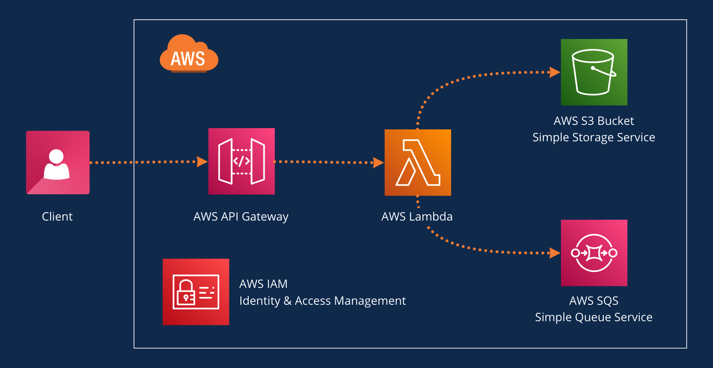

# **Welcome to your CDK TypeScript project**

This is a blank project for CDK development with TypeScript. It uses AWS `Lambda Function`, `API Gateway`, `S3`, and `SQS`.



It was created using `cdk init app --language typescript`.

The `cdk.json` file tells the CDK Toolkit how to execute your app.

## **Prerequisites**
----
This project requires [Homebrew](https://brew.sh/), [Node.js](https://nodejs.org/) 18 and [AWS CDK](https://aws.amazon.com/cdk/?nc1=h_ls) to run locally.

&nbsp;

## **Configuration**
----
### **Environment Variables**
Configure the environment variables in `./config/context.ts`. For Example:

```typescript
  account: "01234567890", // Your AWS account ID
  region: "eu-central-1", // Your AWS account region
  persistence: {
    bucketName: "payload-bucket"
  },
  messaging: {
    queueName: "favorites-queue"
  }
```

&nbsp;

### **GitHub Actions**

Use the following to deploy the app to AWS with Github Actions.

1. **[Add identity provider to AWS](https://docs.github.com/en/actions/deployment/security-hardening-your-deployments/configuring-openid-connect-in-amazon-web-services#adding-the-identity-provider-to-aws)**
   
     - Open IAM on **AWS Management Console** > Choose `Access Management` > Choose `Identity Provider` > **Add Provider**.
     - Choose `OpenID Connect` as Identity Provider.
        > - For the provider URL: Use `https://token.actions.githubusercontent.com` <br> 
        > - For the "Audience": Use `sts.amazonaws.com` if you are using the [official action](https://github.com/aws-actions/configure-aws-credentials).

&nbsp;

2. **[Configuring the role and trust policy](https://docs.github.com/en/actions/deployment/security-hardening-your-deployments/configuring-openid-connect-in-amazon-web-services#configuring-the-role-and-trust-policy)**

   - Open IAM on **AWS Management Console** > Choose `Access Management` > Choose `Roles` > **Create New Role**.
   - Choose `Web Identity` role type.
   - Choose the needed permissions.
     > For development environment use `AdministratorAccess`.
   - Edit the trust policy under `sub` to your repo. For example:

      ```json
        {
          "Version": "2012-10-17",
          "Statement": [
            {
              "Effect": "Allow",
              "Principal": {
                "Federated": "arn:aws:iam::YOUR-AWS-ACCOUNT-ID:oidc-provider/token.actions.githubusercontent.com"
              },
              "Action": "sts:AssumeRoleWithWebIdentity",
              "Condition": {
                "StringEquals": {
                  "token.actions.githubusercontent.com:aud": "sts.amazonaws.com",
                  "token.actions.githubusercontent.com:sub": "repo:{USER-OR-ORG}/{REPONAME}:*"
                }
              }
            }
          ]
        }
      ```

&nbsp;

1. **[Updating GitHub Actions Workflow](https://docs.github.com/en/actions/deployment/security-hardening-your-deployments/configuring-openid-connect-in-amazon-web-services#updating-your-github-actions-workflow)**
  
   - Configure `role-to-assume` in your `.yaml` files to have the correct role for the deployment job. For example:
       
      ```yaml
       name: Configure AWS Credentials
        uses: aws-actions/configure-aws-credentials@v1
        with:
          role-to-assume: arn:aws:iam::YOUR-AWS-ACCOUNT-ID:oidc-provider/token.actions.githubusercontent.com
          aws-region: eu-central-1
      ```

&nbsp;
## **Useful commands**
----

- `npm run build` compile typescript to js (this automatically runs on npm install)
- `npm run watch` watch for changes and compile
- `npm run test` perform the jest unit tests
- `cdk deploy` deploy this stack to your default AWS account/region
- `cdk diff` compare deployed stack with current state
- `cdk synth` emits the synthesized CloudFormation template

&nbsp;

## License
----
[MIT](LICENSE.md)

